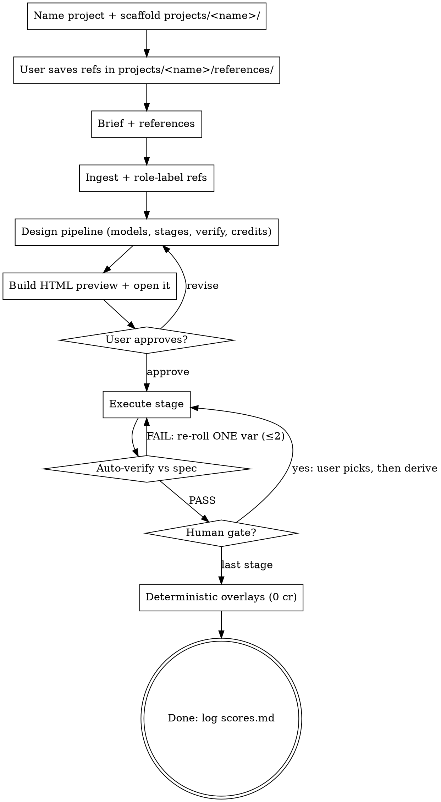

# Higgsfield Brief → Pipeline

## Overview
Turn a **brief + a folder of references** into an **optimal, credit-aware Higgsfield pipeline**,
shown to the user as an **HTML process preview FIRST**, then executed stage-by-stage with
auto-verification, human gates, and zero-credit deterministic overlays for text/dimensions.

Core principle: **spend tokens (planning, verification, overlays) to save credits (renders).**

## Prerequisites

- The [Higgsfield CLI](https://higgsfield.ai) on `PATH`, authenticated via `higgsfield auth login`.
- Python 3.9+. `build_plan_html.py` is pure stdlib; `overlay.py` needs `pillow` + `numpy`.

## Locating this skill's scripts (RUN THIS FIRST)

The two helper scripts ship **inside this skill**, not in the user's project. `scripts/…` is never
relative to the cwd. **`$CLAUDE_PLUGIN_ROOT` is NOT exported into the Bash tool environment** — it
is only set for hooks and MCP servers — so resolve the directory by probing, once per run:

```bash
SK="${CLAUDE_PLUGIN_ROOT:+$CLAUDE_PLUGIN_ROOT/skills/higgsfield-brief-to-pipeline}"
[ -d "$SK" ] || SK=$(ls -d "$HOME"/.claude/plugins/cache/*/higgsfield-brief-to-pipeline/*/skills/higgsfield-brief-to-pipeline 2>/dev/null | sort -V | tail -1)
[ -d "$SK" ] || SK="$HOME/.claude/skills/higgsfield-brief-to-pipeline"
[ -f "$SK/scripts/build_plan_html.py" ] || { echo "FATAL: cannot locate skill dir (tried: $SK)"; exit 1; }
echo "SK=$SK"
```

Covers all three cases in order: hook/MCP context where the env var *is* set → plugin install
(highest version wins) → manual `~/.claude/skills/` install. Every `$SK/…` reference below assumes
it. Bash state does not persist between tool calls — re-resolve `$SK` in each call that needs it,
or inline the block above.

### Self-test (0 credits, no Higgsfield account needed)

A bundled example plan lets you prove the toolchain works before designing anything. Run it if
`$SK` resolution was at all uncertain, or if a script has failed once already:

```bash
python "$SK/scripts/build_plan_html.py" "$SK/examples/plan.example.json" /tmp/selftest.html \
  && echo "SELFTEST OK"
```

Prints `wrote … (5 stages, est 22-30 cr)` on success. It only writes an HTML file — it never
contacts Higgsfield and never spends credits. `$SK/examples/plan.example.json` is also the
reference for `plan.json` shape: read it before writing your own.

## Project layout (ALWAYS start here)

**Every run is a self-contained project under `projects/<project_name>/`.** Never scatter assets
across top-level `inputs/`, `workflow/`, `output/` — that lets a new project clobber the last one's
references. Name the project first (e.g. `flash_cards_v1`), scaffold its folders, then point the user
at the right subfolder for references.

```
projects/<project_name>/          # e.g. projects/flash_cards_v1/
  references/                      # USER drops reference images HERE (the "right folder")
  workflow/                        # prompts, render logs, research notes, overlay configs, helper scripts
  output/                          # rendered deliverables, organized NN_stage/ subfolders
  plan.json                        # the pipeline spec (input to build_plan_html.py)
  plan.html                        # THE GATE — the HTML preview the user approves
  style-spec.json                  # CANONICAL design system: locked rules, prompts, palette, overlay coords
  scores.md                        # per-stage auto-verification log
```

Use a lowercase, version-suffixed slug for `<project_name>` (`flash_cards_v1`, `booth_reskin_v2`).

### style-spec.json — the reusable source of truth

`style-spec.json` is what turns a one-off batch into a **reproducible, scalable system**. It captures
every locked decision so future runs (more variants, the rest of a set, a v2) don't relitigate
anything — they substitute placeholders into saved templates and rerun. Treat it as living state:

- **On start, READ it first** (if it exists). Reuse the brand, palette, models, ref-roles, prompt
  templates, overlay coordinates and locked decisions — do not re-ask what's already settled.
- **WRITE/append to it as decisions lock** — after the plan is approved, and after every human gate
  (chosen anchor, palette, brand, overlay coords, naming rules, per-stage verify criteria).
- **Keep prompts in `workflow/_prompts/`** as concrete files; have `style-spec.json` reference them
  by path AND record their `{PLACEHOLDERS}` + role-labelled reference order so the set scales by
  substitution (e.g. `{LETTER}`/`{ANIMAL}` for the other 25 cards) with no re-deciding.
- Record **deterministic overlay coordinates** (text positions, callout anchors) here — that's what
  makes the 0-credit text layer repeatable across a whole set without re-measuring.
- Suggested top-level keys: `brand`, `concept`, `palette`, `card_format`, `anatomy_normalized`,
  `art_style`, `naming_conventions`, `shiny_rules`(domain-specific), `models`, `reference_roles`,
  `prompt_templates`, `overlays`, `verification`, `locked_decisions`, `open_items`.

## The Iron Rule

**NEVER run a credit-spending render before the user approves the HTML process preview.**
This is non-negotiable and survives every shortcut:

| Rationalization | Reality |
|---|---|
| "The brief is simple, I'll just render" | Simple briefs still cost credits and miss unstated constraints. Preview first. |
| "I'll show the plan as text, faster" | The user requires HTML. A markdown list is not the gate. |
| "Just one validation render to check" | Even the validation render waits for approval — it's IN the plan. |
| "They already described what they want" | A description is not approval of a credit budget + stage breakdown. |

Build the HTML, open it, **wait for "approve"** (or revisions). Then run.

## Workflow



### 0. Name + scaffold the project (ALWAYS FIRST)
- **Before anything else, agree on a project name** with the user (e.g. `flash_cards_v1`). If they
  didn't give one, propose a lowercase version-suffixed slug and confirm it.
- Scaffold the folders:
  `mkdir -p projects/<project_name>/references projects/<project_name>/workflow projects/<project_name>/output`
- **Tell the user to save their reference images in `projects/<project_name>/references/`** — that is
  the only correct place for refs. Wait until they confirm the files are there before ingesting.
- All later paths in this skill (`plan.json`, `plan.html`, `scores.md`, `output/NN_stage/…`) live
  **inside `projects/<project_name>/`**.

### 1. Ingest
- **If `projects/<project_name>/style-spec.json` exists, read it FIRST** and reuse its locked choices
  (brand, palette, models, ref-roles, prompt templates, overlay coords) — skip re-asking settled things.
- Read the brief. Glob `projects/<project_name>/references/`. **Open every reference image** and assign
  each a role: structure / material / style-DNA / logo / product / format / scene. Confirm `higgsfield
  account status` (auth + remaining credits). If auth fails, ask the user to run `higgsfield auth login`.

### 2. Design the pipeline
- Pick models from `$SK/references/higgsfield-models.md`. Confirm model **IDs/availability** with
  `higgsfield model list --json` (it has no cost field — credit costs are **estimates** from the
  reference table / Higgsfield dashboard; present them as such, never as fixed prices).
- Decompose into stages. For each stage define: model, params (resolution/aspect), the ordered
  role-labelled references, variant count, **explicit auto-verify criteria** (that couple to the
  prompt's hard constraints), credit estimate, and whether it ends in a **human gate**.
- Apply all credit-optimisation rules: validation-first, parallelise, **derive-don't-regenerate**
  (lock an anchor at a gate → feed as image-1 identity downstream), one-change-per-reroll, and
  **deterministic overlays for any text/dimensions/labels (0 credits)**.
- Write prompts from `$SK/references/prompting-principles.md` (role-label, lock structure, force
  technical view, repeat hardest constraint at the end). Save each concrete prompt to
  `workflow/_prompts/` and record its template + `{PLACEHOLDERS}` + ref order in `style-spec.json`.

### 3. HTML preview (THE GATE)
- Write the plan as `projects/<project_name>/plan.json` (schema in `$SK/scripts/build_plan_html.py`,
  worked example in `$SK/examples/plan.example.json`), then:
  `python "$SK/scripts/build_plan_html.py" projects/<project_name>/plan.json projects/<project_name>/plan.html`.
  Surface the absolute path (and on a desktop session, offer to open it — e.g. `start`/`open` the file).
  In a headless run, the path IS the deliverable.
- Stop. Wait for approval or revisions. Loop back to step 2 on changes.

### 4. Execute
- Run renders per stage. Independent renders → background processes, tee to logs, poll for URLs
  (see models ref). Download with `curl`. Auto-verify each output by opening it and scoring it
  against the stage criteria; FAIL → re-roll ONE variable (≤2 retries). Log every verdict to
  `projects/<project_name>/scores.md`. Honour human gates — stop and let the user pick before deriving
  downstream views.
- Final stage: composite dimensions/annotations with `$SK/scripts/overlay.py` (dims | annotate).
- **After each human gate, update `style-spec.json`** with the locked decision (chosen anchor/identity,
  palette, brand, overlay coordinates, naming rules) so the next run/iteration reuses it.
- Organise outputs under `projects/<project_name>/output/NN_stage/…` and report URLs + one-line
  summaries — no raw JSON.

## Quick reference

| Action | Command |
|---|---|
| Auth/credits | `higgsfield account status` |
| Live model IDs/costs | `higgsfield model list --json` |
| Multi-ref render | `higgsfield generate create <model> --image A --image B --resolution 2k --aspect_ratio 4:3 --wait --prompt "…"` |
| Self-test the toolchain (0 cr) | `python "$SK/scripts/build_plan_html.py" "$SK/examples/plan.example.json" /tmp/selftest.html` |
| Scaffold a project | `mkdir -p projects/<name>/references projects/<name>/workflow projects/<name>/output` |
| Build the preview gate | `python "$SK/scripts/build_plan_html.py" projects/<name>/plan.json projects/<name>/plan.html` |
| Dimension overlay (0 cr) | `python "$SK/scripts/overlay.py" dims in.png out.png dims.json` |
| Annotation overlay (0 cr) | `python "$SK/scripts/overlay.py" annotate in.png out.png annos.json` |

`overlay.py` needs `pillow` + `numpy`. `$SK` is resolved in "Locating this skill's scripts" above.

## Common mistakes
- **Using a bare `scripts/…` path.** The scripts live in the skill, not the project. Resolve `$SK` first.
- **Assuming `$CLAUDE_PLUGIN_ROOT` is set.** It is not exported to the Bash tool — only to hooks and
  MCP servers. Use the probe block above; a bare `$CLAUDE_PLUGIN_ROOT/…` expands to `/skills/…` and fails.
- **Skipping the project scaffold.** Dumping refs in top-level `inputs/` lets the next project clobber
  them. Always `projects/<name>/` first, refs in `projects/<name>/references/`.
- **Not persisting decisions to `style-spec.json`.** Re-asking settled choices or re-measuring overlay
  coords on every run. Read it on start, write to it on every lock — it's how a set scales cheaply.
- **Rendering before the HTML gate.** The #1 violation. Always preview, always wait.
- **Un-roled references** dumped into one prompt → muddy fusion. Label every image.
- **Re-generating a design downstream** instead of feeding the approved anchor as identity → drift + wasted credits.
- **Letting the image model type dimensions/menus/labels.** Misspells, costs credits. Use `overlay.py`.
- **Serializing independent renders** with `--wait`. Background + poll instead.
- **Guessing aspect ratio** for a composite. Measure the scene photo (`Pillow im.size`).
- **Hardcoding credit costs.** Re-check `model list --json`; costs drift.
